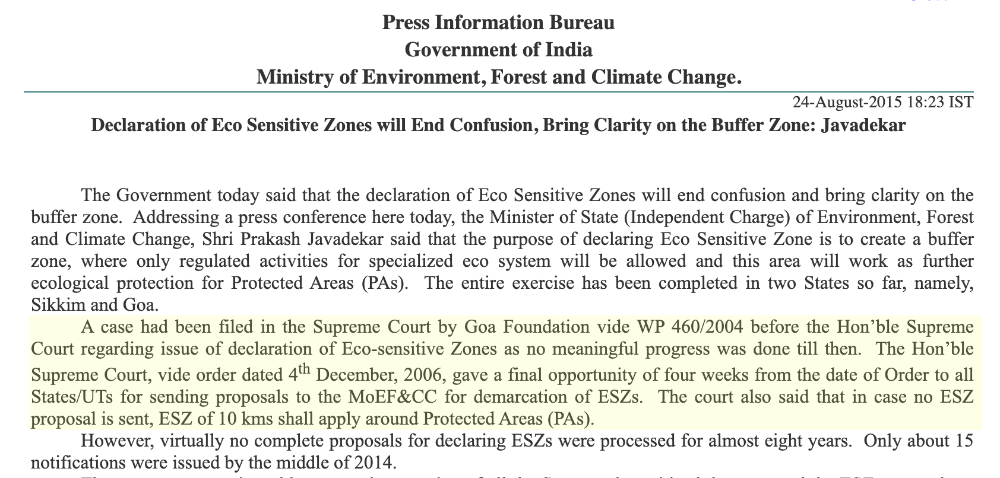

# india-esz-dashboard

A frontend dashboard to show current status of ESZ notifications by the Ministry of Environment Forests & Climate Change (MoEFCC), Government of India. **[Live dashboard &rarr;](https://publicmap.github.io/india-esz-dashboard/)**

**Features**

- Mirror the ESZ notification HTML table on https://www.moef.gov.in/esz-notifications, updated weekly. [View](data/raw/moef-esz-notifications-table.html)
- Interactive map dashboard showing:
    - KPIs for total protected areas vs. draft/final ESZ notification coverage
    - Protected area locations colored by ESZ notification status, with a filterable/sortable notification table
    - PA boundaries (where mapped on OpenStreetMap) explorable via a custom [amche-atlas](https://amche.in/dev/) atlas
- Download the notification list and protected area list as CSV/JSON, and protected area locations as GeoJSON
- Conflation with protected area data on wikidata.org

## About Eco-Sensitive Zones (ESZs)

ESZs are designated buffer areas around protected habitats like national parks and wildlife sanctuaries. They act as shock absorbers to minimize human impact on fragile ecosystems, typically spanning up to 10 kilometers, though boundaries remain site-specific

The purpose of declaring ESZs is to create buffer zones for the protected areas by regulating and managing the activities around such areas. They also act as a transition zone from areas of high protection to areas involving lesser protection.

Source: [Wikipedia](https://en.wikipedia.org/wiki/Eco-sensitive_zone)

**About ESZ Notifications**

><br>
Source: [PIB, Ministry of Environment Forests & Climate Change, Government of India](https://www.pib.gov.in/newsite/PrintRelease.aspx?relid=126299&reg=48&lang=2)

- 2002: The Indian Board for Wildlife proposed 10km buffer zones under the Environment Protection Act of 1986 to insulate national parks and sanctuaries
- 2004: The Goa Foundation filed a landmark case [(PIL Writ Petition 460/2004)](https://indiankanoon.org/doc/81576067/) in the Supreme Court of India demanding action against authorities for failing to notify ESZs around protected wildlife areas
- 2006: Supreme Court of India directs all State/UTs to define ESZ around protected areas within 4 weeks failing which a [10km ESZ will apply](https://www.pib.gov.in/newsite/PrintRelease.aspx?relid=126299&reg=48&lang=2)
- 2011: [Guidelines for declaration of ESZ](https://cpc.parivesh.nic.in/writereaddata/Guidelines_for_EcoSensitive_Zones_around_Protected_Areas.pdf) pulbished by MoEFCC outlining procedures to State/UTs to demarcate and notify ESZ with the following details:
```
(i) Delineation of the physical boundaries on a topo-sheet with precise
description in geographic terms together with a description of the
significant features/attributes that would potentially qualify the area as
eco-sensitive zone. A description of the boundaries alongwith the list of
villages with exception and exemption in the delineated buffer zone area.
(ii) An inventory of the existing legal status of rights, entitlements, privileges and obligations of the local communities.
(iii) A description of bio-diversity values including bio-geographical
representatives, endemism, species richness, geo-morphological
characteristics, and unique land use practices including aesthetic and
cultural values.
(iv) A description of the resource base indicating the economic potential and
livelihood implication for the people residing in and around the
proposed eco-sensitive area.
(v) An inventory of activities to be regulated and/ or prohibited in the
proposed eco-sensitive zone.
(vi) List of the protected areas for declaring eco-sensitive zone.
- 2012: Due to lack of progress on ESZ identification, [CEC reccomends a safety zone of 100m-2000m metres](https://hash-cookies.s3.amazonaws.com/CEC%20buffer%20zones%20report%2020.9.2012.pdf) in the interim based on protected area size
```
- 2022: [Supreme Court mandates a minimum 1km ESZ](https://api.sci.gov.in/supremecourt/1995/2997/2997_1995_5_1501_36130_Order_03-Jun-2022.pdf) around all protected areas
- 2023: [Supreme Court relaxes 2022 order to define minimum ESZ](https://api.sci.gov.in/supremecourt/1995/2997/2997_1995_8_1501_43924_Judgement_26-Apr-2023.pdf) to be protected area specific citing uniform minimums being impossible to implement.

## Data pipeline

```
npm install
npm run update   # fetch -> parse -> clean -> enrich:osm -> enrich:wikidata -> enrich:archive -> enrich:allmaps -> build:geojson -> build:full-join -> build:atlas
```

Runs weekly via `.github/workflows/update.yml`; the dashboard (`index.html`) is redeployed to GitHub Pages afterwards by `.github/workflows/pages.yml`. Enable Pages once under repo Settings &rarr; Pages &rarr; Source: "GitHub Actions".

`npm run update` is just those steps chained together. Each can also be run on its own,
which is useful when re-running only the part affected by a correction (see
[Contributing corrections](#contributing-corrections) below) instead of the whole
pipeline:

| # | Command | Reads | Writes | What it does |
| - | --- | --- | --- | --- |
| 1 | `npm run fetch` | https://moef.gov.in/esz-notifications, three Wikipedia protected-area list pages | `data/raw/moef-esz-notifications-table.html`, `data/raw/{national-parks,wildlife-sanctuaries,tiger-reserves}-table.html` | Scrapes the raw MoEF ESZ notifications table HTML, plus the Wikipedia national parks/wildlife sanctuaries/tiger reserves list tables (each combined from that page's per-state sub-tables into one table) |
| 2 | `npm run parse` | the raw tables from step 1 | `data/moef/esz-notifications.json`, `data/wikipedia/{national-parks,wildlife-sanctuaries,tiger-reserves}.{csv,json}` | Parses the MoEF table into one structured record per Draft/Final notification (`parse:moef`) and the three Wikipedia tables into one structured record per protected area (`parse:wikipedia`) |
| 3 | `npm run clean` | `data/moef/esz-notifications.json`, `data/corrections.csv` | `data/moef/esz-notifications.json` | Applies manual corrections, splits multi-park notifications into one record per area, canonicalizes names/types |
| 4 | `npm run enrich:wikidata` | `data/moef/esz-notifications.json`, live Wikidata SPARQL, `data/wikipedia/{national-parks,wildlife-sanctuaries,tiger-reserves}.json`, `data/osm/protected-areas.csv` (if present) | `data/wikidata/protected-areas.{csv,json}`, `data/wikidata/qa-log.md`, `data/moef/esz-notifications.{csv,json}` (+ `wikidataId`/`matchConfidence`), `data/enrichment-cache.csv` | Fetches the full Wikidata list of Indian protected areas; cross-references it against the three Wikipedia lists to correct outdated `protectedAreaType` categorization and add any protected area Wikipedia has that Wikidata doesn't (building `data/wikidata/protected-areas.json` as the master PA list); cross-references OSM boundaries by `wikidata` tag; links each MoEF notification to its master-list item |
| 5 | `npm run enrich:archive` | `data/moef/esz-notifications.json`, archive.org search | `data/moef/esz-notifications.{csv,json}` (+ `notificationArchiveLink`), `data/enrichment-cache.csv` | Looks up each notification's official gazette scan on archive.org |
| 6 | `npm run enrich:allmaps` | `data/enrichment-cache.csv` | `data/enrichment-cache.csv` (+ Allmaps fields) | Adds Allmaps IIIF georeferencing links for toposheet scans found in step 5 |
| 7 | `npm run build:geojson` | `data/wikidata/protected-areas.json`, `data/moef/esz-notifications.json` | `data/protected-areas.geojson` | Builds the point-feature GeoJSON (PA location + ESZ status) |
| 8 | `npm run build:full-join` | `data/wikidata/protected-areas.json`, `data/moef/esz-notifications.json` | `data/full-join.json` | Builds the full outer join of Wikidata PAs and MoEF notifications (keyed by `wikidataId`, falling back to state+name for unmatched records) with a precomputed representative notification per PA &mdash; the single file `index.html`/`assets/app.js` load to render the table and map |
| 9 | `npm run build:atlas` | `data/protected-areas.geojson` | `data/amche-atlas.json` | Builds the [amche-atlas](https://github.com/publicmap/amche-atlas/blob/dev/docs/API.md) config (PA points + live OSM-relation boundary layers) |

Steps 4–6 cache their lookups in `data/enrichment-cache.csv`, so re-running them after
the first full run is fast — only new/changed notifications are re-fetched.

Outputs:
- `data/moef/esz-notifications.{csv,json}` — one row per protected area per notification, with a `wikidataId` join key
- `data/wikipedia/national-parks.{csv,json}` — one row per national park, from [List of national parks of India](https://en.wikipedia.org/wiki/List_of_national_parks_of_India)
- `data/wikipedia/wildlife-sanctuaries.{csv,json}` — one row per wildlife sanctuary, from [List of wildlife sanctuaries of India](https://en.wikipedia.org/wiki/List_of_wildlife_sanctuaries_of_India)
- `data/wikipedia/tiger-reserves.{csv,json}` — one row per tiger reserve (with coordinates), from [Tiger reserves of India](https://en.wikipedia.org/wiki/Tiger_reserves_of_India)
- `data/wikidata/protected-areas.{csv,json}` — the master protected-area list: every Wikidata item in scope (`protectedAreaType` corrected against the Wikipedia lists where they disagree), plus a `dataSource: "wikipedia"` entry (synthetic `WIKIPEDIA:...` id, no real Wikidata QID) for any Wikipedia protected area with no Wikidata match, cross-referenced with OSM boundary ids where matched
- `data/wikidata/qa-log.md` — QA report for both cross-reference passes: **Wikidata ↔ Wikipedia joins** (type corrections, multi-matched items, new master-list entries, unmatched items on either side) and **Wikidata ↔ OSM joins** (unmatched items, outdated ids, coordinate/name mismatches) — for manual review
- `data/protected-areas.geojson` — PA point locations with ESZ status
- `data/full-join.json` — full outer join of the two above, one entry per protected area with its notification history nested; this is what the dashboard actually loads (downloadable CSV/JSON/GeoJSON links on the page still point at the individual files above)
- `data/amche-atlas.json` — custom [amche-atlas](https://github.com/publicmap/amche-atlas/blob/dev/docs/API.md) config (PA points + OSM-relation boundary layers)
- `data/enrichment-cache.csv` — persistent cache of Wikidata/archive.org lookups so repeat runs are fast

## Contributing corrections

This is scraped and joined data from a government site and Wikidata, so it's imperfect —
corrections are welcome via pull request. Depending on what's wrong, fix it at a
different point in the pipeline rather than editing the generated `data/*.json`/`*.csv`
outputs directly, since those get overwritten the next time the pipeline runs:

- **A MoEF notification's protected area name, state, or type is wrong or garbled**
  (e.g. a mis-scraped name, a multi-park notification that didn't split correctly) —
  add a row to [`data/corrections.csv`](data/corrections.csv) keyed by the *exact*
  `paName`/`state` as they currently appear in `data/moef/esz-notifications.json`, with
  `correctPaName`/`correctState`/`correctPaType` set to the fix (leave a column blank to
  leave that field alone). Applied by `scripts/clean-moef-data.js`. Re-run `npm run
  clean` (or the full pipeline from step 3 onward) to verify.
- **A state name is wrong or inconsistent everywhere it appears** (e.g. an old/misspelled
  state name used across many notifications) — add a row to
  [`data/corrections.csv`](data/corrections.csv) with `paName`/`correctPaName`/
  `correctPaType` left blank, just `state` (the exact value to match) and `correctState`
  (the fix). This renames the state on *every* MoEF record with that state, instead of
  needing one row per protected area.
- **A Wikidata field is wrong or missing** (state, admin territorial entity, coordinates,
  IUCN category, etc.) — fix it at the source: edit the item on
  [wikidata.org](https://www.wikidata.org/), then re-run `npm run enrich:wikidata` (or
  `npm run update`) to pull the fix back into this repo. For rows missing a `state` or
  `locatedInAdminTerritorialEntity` value, `npm run suggest:missing-state` /
  `npm run suggest:missing-located-in` can suggest one by reading the item's Wikipedia
  article — see [`scripts/plugins/README.md`](scripts/plugins/README.md) for that
  workflow before batch-editing Wikidata.
- **A gazette/archive.org or toposheet link is wrong** — the `toposheet page` column in
  [`data/enrichment-cache.csv`](data/enrichment-cache.csv) is a manual override read by
  `scripts/enrich-allmaps.js`; other archive fields are safe to blank out to force
  `npm run enrich:archive` to re-look them up on the next run.
- **Something else** (pipeline bug, dashboard bug, new feature) — open an issue or PR as
  usual.